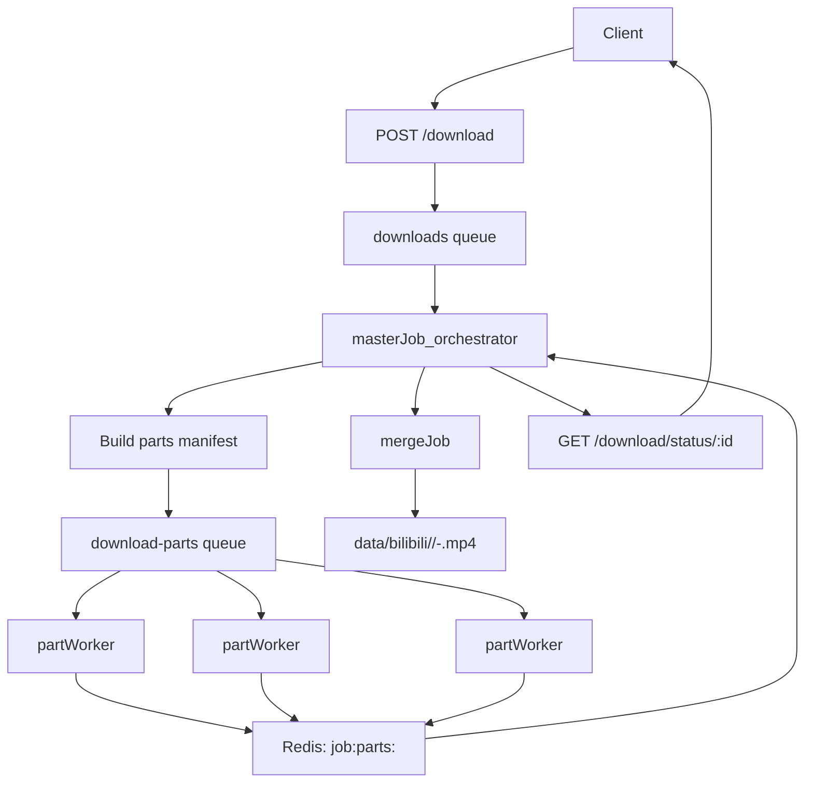

# Parallel segmented downloads plan

## Goal

Enable downloading a single video using many workers by splitting the work into independent parts, downloading in parallel, then combining into a final playable file.

## 1. Segmentation strategy (size vs duration)

### DASH/HLS (preferred path)

- **Primary rule**: treat each *manifest segment* as the smallest atomic unit, then **group segments by approximate byte size** into larger “parts” to balance work across workers.
- **Why**:
  - Manifests already define safe boundaries (duration-based segments); reusing them avoids boundary/container corruption.
  - Duration alone is a poor proxy for load-balancing (bitrate varies). Targeting **bytes** makes parts more even.
- **How**:
  - Build a segment list:
    - `segmentIndex`, `url`, `durationSec`, `approxBytes`
    - `approxBytes` from `content-length` (HEAD) when possible (or metadata when available).
  - Choose `targetPartSizeBytes` (default: **8 MB**).
  - Fold segments into parts until sum(approxBytes) reaches target.
  - Persist a manifest where each part includes:
    - `partIndex`, `segmentIndexes[]`, `expectedBytes`, `state`, `downloadedBytes`
  - Each part becomes a subjob in `download-parts`.

### HTTP byte-range split (fallback path)

- **Rule**: when no segment manifest is available, split by **byte ranges only**.
- **Why**: only total size and `Accept-Ranges` are known; duration is unreliable for splitting.
- **How**:
  - HEAD/initial request to get `content-length` and confirm `Accept-Ranges: bytes`.
  - Choose `targetPartSizeBytes` (default **8 MB**) or an explicit `partCount`.
  - Compute contiguous ranges `[start, end]` covering the full object.
  - Each range is a part-subjob with `expectedBytes = end - start + 1`.

## 2. Progress and metrics (bytes-first)

### Per-part accounting

- Maintain in Redis a structure like `job:parts:<jobId>` (hash or JSON) containing, for each part:
  - `expectedBytes`
  - `downloadedBytes`
  - `state` (`pending` | `active` | `completed` | `failed` | `cancelled`)
- Each part-worker updates `downloadedBytes` periodically by either:
  - Counting streamed bytes (recommended: extend `resumeDownload()` to accept an `onProgress(bytesDelta)` callback), or
  - Polling partial file sizes on disk and writing them back to Redis (simpler, less accurate).

### Total job progress

- Precompute:
  - `totalExpectedBytes = sum(parts.expectedBytes)`
- Compute:
  - `totalDownloadedBytes = sum(parts.downloadedBytes)`
  - `percent = (totalDownloadedBytes / totalExpectedBytes) * 100` (bounded to [0, 100])
- Status endpoint can expose:
  - `totalBytes`, `downloadedBytes`, `percent`
  - `partsCompleted`, `partsTotal`

### Duration-based view (optional, derived)

- For DASH/HLS only:
  - `totalDurationSec = sum(segments.durationSec)`
  - `downloadedDurationSec = sum(durations of segments belonging to completed parts)`
- Expose as secondary UI metrics only (do not drive control logic).

## 3. Master job location (API vs worker)

- **Decision**: the **master/orchestrator runs in a worker**, not inside the API request.
- **Rationale**:
  - The API should stay short-lived: accept request, enqueue one top-level job, serve status/history.
  - The master job does network I/O, computes segmentation, creates subjobs, monitors completion, retries, and may run longer—this matches the worker runtime.

## 4. Orchestration design (master + part jobs + merge)

1. **Master job** (Bull job in `downloads`) determines strategy and builds a parts manifest.
2. Master creates N **part subjobs** in queue `download-parts` with metadata:
   - `{ jobId, partIndex, url|range, expectedBytes, segmentIndexes? }`
3. Workers pick part subjobs and download to:
   - `data/<jobId>/parts/<index>.part` (or per-segment files if desired)
   - On success, rename to `.complete`.
4. Track part statuses in Redis under `job:parts:<jobId>`.
5. When all parts complete, enqueue a **merge job** (or merge inline in master) and then finalize output location.

## 5. High-level orchestration flow

## 5. How this maps to existing files

- **Orchestrator (master job)**
  - Extend or refactor `src/worker/worker.processor.ts` so that `handleJob` becomes the master orchestrator:
    - If parallelizable: perform steps 1–4 above instead of the current single `resumeDownload` sequence.
    - If not parallelizable or feature is disabled: keep existing behavior.
- **Part workers**
  - New Bull processor, e.g. `src/worker/parts.processor.ts`:
    - `@Processor('download-parts')`.
    - For each part:
      - For DASH/HLS: loop over its assigned segment URLs and stream them to `data/<jobId>/parts/...` (using `resumeDownload`).
      - For byte-range: use `Range` requests and stream into `part-<index>.bin`.
      - Update `job:parts:<jobId>` in Redis with `downloadedBytes` and `state`.
- **Merge job**
  - Either:
    - Implement as another step in the master job (after all parts complete), or
    - Use a dedicated queue `download-merge` with a small processor that reads the manifest and writes the final `.mp4`.
- **Status API changes**
  - `GET /download/status/:id` (e.g. `src/download/download.controller.ts`) can be extended to read `job:parts:<jobId>` and expose:
    - `totalBytes`, `downloadedBytes`, `percent`
    - `partsCompleted`, `partsTotal`

## 6. Final output location (post-merge)

After merging into a playable video, move the result into:

- `data/bilibili/<video-title>/<video-id>-<job-id>.mp4`

For Bilibili:
- **video-id** is `bvid` (e.g. `BV...`)

Notes:
- `<video-title>` must be sanitized for filesystem safety (remove `/\\:*?"<>|`, trim, collapse whitespace, limit length).
- Keep all intermediate artifacts under `data/<jobId>/...` and only move/rename the final file at the end.

How to obtain `<video-title>`:
- Call Bilibili view API once in the master job and persist it in the manifest:
  - `GET https://api.bilibili.com/x/web-interface/view?bvid=<bvid>`

## 7. Partial merge when master job is stopped/failed

When a master job is stopped/failed, we can still attempt a **best-effort** merge into a watchable video.

- **Default policy**: merge only a **contiguous prefix from the start** (no gaps). This is the safest approach to maximize playability.

Rules:
- **Segments strategy (DASH/HLS)**:
  - Merge segments `0..k` where every segment is present and verified (`.complete`).
  - Stop at the first missing segment.
- **Byte-range strategy**:
  - Merge only if parts cover `[0..X]` with no gaps.
  - Output is a byte-prefix; container playability varies, but prefix-only is safest.

### New API: merge partial parts

- `POST /download/:id/merge-partial`
  - Only available / enabled when the master job is in a **failed** or **stopped** terminal state.
  - Reads `data/<jobId>/manifest.json` (and/or Redis `job:parts:<jobId>`).
  - Computes the largest contiguous prefix of completed parts/segments.
  - Merges that prefix only.
  - Writes output to:
    - `data/bilibili/<video-title>/<video-id>-<job-id>-partial.mp4`
  - Appends job history events like:
    - `{ state: 'partial-merging', progress: <...> }`
    - `{ state: 'partial-merged', progress: 100, result: { path, mergedBytes, totalBytes, percent } }`
  - If prefix length is 0, return `422` and record `{ state: 'partial-merge-not-possible' }`.

## 8. Resumability

- Each part worker uses `resumeDownload(onProgress)` (segment URL downloads or byte ranges).
- `onProgress(bytesDelta)`:
  - Updates `downloadedBytes` for the part in Redis.
  - Is invoked frequently enough that the master/status poll (every 5s) sees fresh progress under normal network conditions.
- Persist per-part progress and partial files; retry/resume by reusing Range or re-requesting segment URLs.

### 8.1 Stall detection and job failure

- The system polls job progress approximately every **5 seconds**.
- For each download job:
  - Track, per part (and/or segment file), whether its `downloadedBytes` has increased since the last poll.
  - If **no growth** is observed for a given part for **3 consecutive polls** (~15s total) and the part is still `active`, treat this as a **stall**.
- When a stall is detected:
  - Mark the overall download job as **failed**.
  - Include in the failure reason:
    - Current aggregate progress (bytes/percent).
    - Which part/segment stalled.
    - Which worker was processing it (job id / worker id, as available).
  - Coordinate with the master to stop the job and all of its sub-jobs.

## 9. Merging examples

- DASH/HLS (segments):
  - `ffmpeg -f concat -safe 0 -i parts.txt -c copy output.mp4` (for compatible segments)
  - Or `MP4Box -cat ... -new out.mp4` depending on format
- Byte-range (MP4):
  - Prefer `MP4Box` for concatenation, or remux via `ffmpeg` (may require re-encoding)

## 10. Integrity & verification

- Compute checksums (SHA256/MD5) for each part and verify before merging.
- After merge, run `ffprobe` to verify stream integrity (optional but recommended).

## 11. Coordination & cancellation

- Use Redis for coordination and control signals:
  - `job:stop:<jobId>` (stop)
  - `job:parts:<jobId>` (progress/parts state)
- Workers should abort cooperatively by checking stop/cancel signals:
  - On `job:stop:<jobId>`:
    - **Hard-stop immediately** by aborting the active HTTP stream / file write.
    - Leave any partially written segment/part file on disk, but do **not** mark its part as `completed`.
  - On the next `resumeDownload` for that job:
    - Skip any unfinished segment/part files that were in-progress when the stop occurred.
    - Continue from the next segment/byte-range according to the manifest.

## 12. Risks & limits

- Source servers may throttle many connections—start with conservative concurrency.
- Byte-range reassembly for MP4 is fragile—prefer segments.
- Disk I/O and network concurrency increase—monitor resource usage.

## Next steps (implementation milestones)

1. Implement master orchestration for DASH (manifest → parts → merge) with a small default concurrency.
2. Add Redis part-tracking + progress computation and expose it in `GET /download/status/:id`.
3. Add partial-merge endpoint `POST /download/:id/merge-partial`.
4. Optionally prototype byte-range fallback for cases with no manifest.